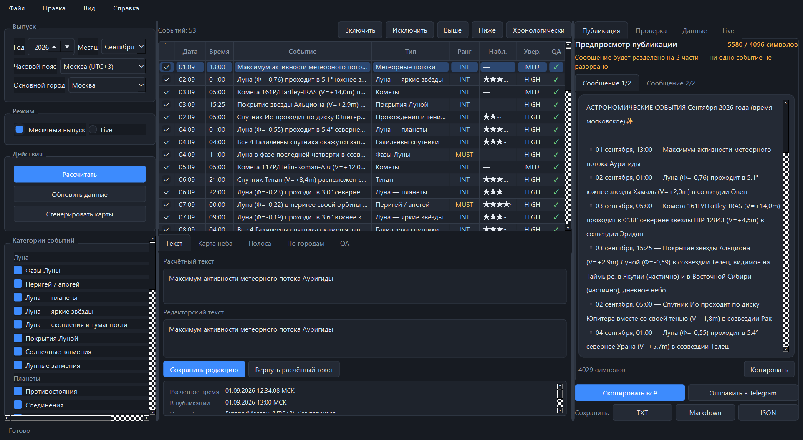
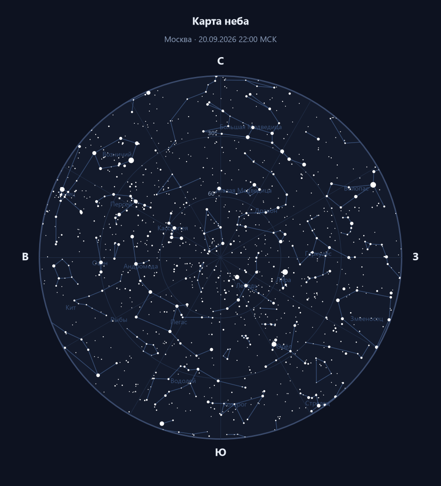
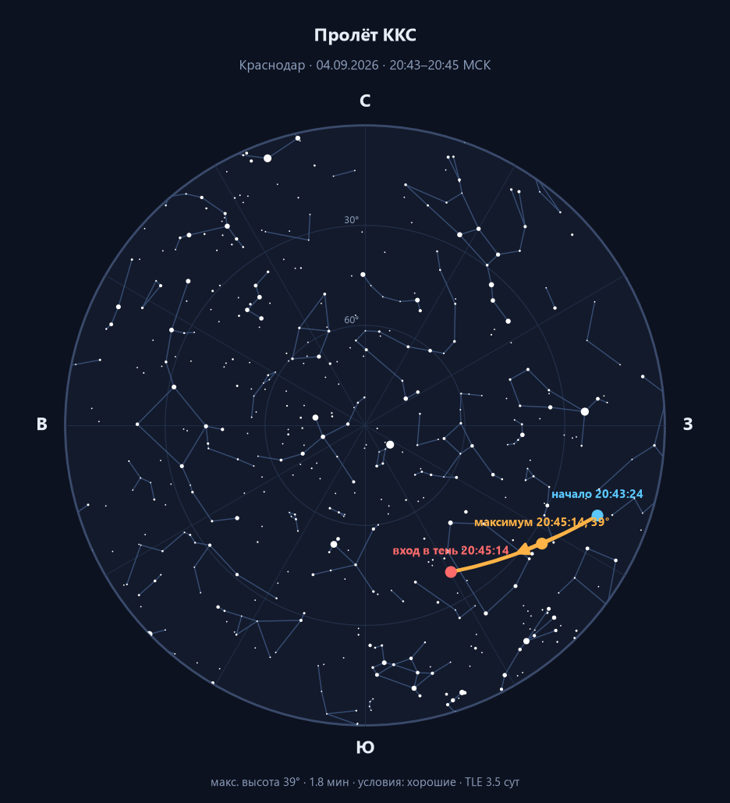
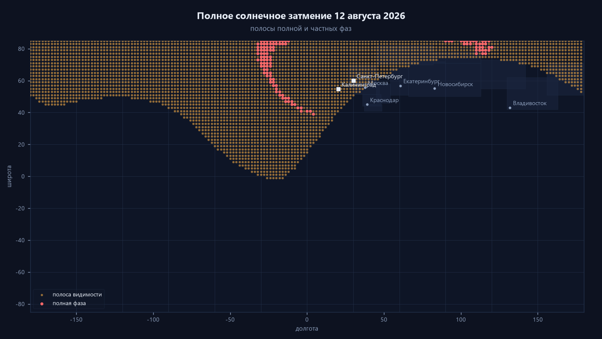
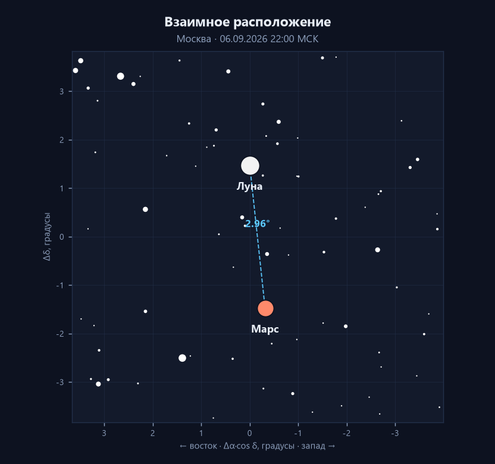

# AstroCalendar Studio

**Открытая настольная система подготовки, проверки и визуализации
астрономических календарей.**

Полный путь одного выпуска в одном окне: расчёт событий месяца → независимая
проверка каждого значения → редакторский отбор → правка формулировок → карты
неба и полос видимости → предпросмотр публикации с лимитом Telegram →
готовый текст в буфере обмена.

Расчётное ядро считает всё заново по эфемеридам JPL, каталогам Hipparcos и
OpenNGC, элементам MPC и лентам предсказаний IOTA, а ключевые величины
сверяются с JPL Horizons. Проект создавался в том числе на реальных выпусках
канала [AstroAlert](https://t.me/astroalert_space) и проверен на двух из них —
за август и сентябрь 2026 года. **Официальным продуктом канала он не является.**



---

## Содержание

- [Что умеет](#что-умеет)
- [Как запустить](#как-запустить)
- [Windows](#windows)
- [Как работает редактор](#как-работает-редактор)
- [Карты](#карты)
- [Наблюдательный слой](#наблюдательный-слой)
- [Проверка и полнота](#проверка-и-полнота)
- [AstroCalendar Live](#astrocalendar-live)
- [Командная строка](#командная-строка)
- [Как это устроено технически](#как-это-устроено-технически)
- [Источники данных](#источники-данных)
- [Тесты](#тесты)
- [Документация](#документация)
- [Ограничения](#ограничения)

---

## Что умеет

### Расчёт событий

- **Луна:** фазы, перигей и апогей, сближения с планетами, яркими звёздами и
  объектами каталогов, покрытия с полосой видимости.
- **Затмения:** солнечные (полосы полной и частных фаз, момент наибольшего
  затмения) и лунные (контакты теневой фазы, откуда видно).
- **Планеты:** стояния, противостояния, соединения, элонгации, максимальный
  блеск, тесные пары, периоды утренней и вечерней видимости.
- **Спутники планет:** конфигурации галилеевых спутников, их прохождения по
  диску, тени, покрытия и затмения; положение Титана.
- **Малые тела:** кометы с кросс-матчем по каталогам, перигелий, минимум
  расстояния и максимум блеска; яркие астероиды.
- **Сближения околоземных астероидов:** список CNEOS, отбор по явным порогам
  значимости (ближе Луны — событие месяца), оценка размера по H с границами
  по альбедо и расчёт реальной наблюдаемости: ожидаемый блеск, высота, лучшее
  время, скорость движения по небу. Блеск сверяется с независимой таблицей
  ван Бёйтенена — расхождение больше половины величины помечается в проверке.
- **Яркие околоземные астероиды на год вперёд:** отбор по блеску, а не по
  размеру камня. Максимум блеска объекта может прийтись на месяц, до которого
  месячный расчёт ещё не дошёл: так 1999 AN10 выйдет на +7,6ᵐ в августе
  2027 года, и знать об этом полезно заранее.
- **Покрытия звёзд астероидами:** кандидаты из лент IOTA, полоса пересчитана
  по актуальной орбите JPL, границы полосы, регионы и города в полосе,
  возраст прогноза и возраст решения орбиты. Полнота проверяется по
  контрольному списку наблюдателей на год.
- **Открытия:** вновь появившиеся кометы MPC и новые со сверхновыми из TNS —
  через [AstroCalendar Live](#astrocalendar-live).
- **Метеорные потоки:** момент максимума по солнечной долготе, высота радианта,
  окно наблюдения и помеха от Луны.
- **Данные:** программа сама скачивает эфемериды и каталоги при первом запуске
  и показывает возраст каждого источника.
- **Лунные наблюдательные явления:** Lunar X и Lunar V, благоприятные либрации,
  молодой и старый серп.
- **Космонавтика:** пуски со статусом Launch Library 2, периоды видимости МКС и
  китайской станции.

### Редакторская работа

Таблица событий с галочками, сортировкой, множественным выделением, пакетным
включением и ручным порядком. Отдельные поля для расчётного и редакторского
текста. Ручные события с явной пометкой. Сохранение всего состояния между
запусками.

### Публикация

Предпросмотр в виде сообщения мессенджера, счётчик длины по правилам Telegram,
автоматическое разбиение на части без разрыва событий, копирование в буфер,
экспорт TXT / Markdown / JSON, отправка в канал с подтверждением.

---

## Как запустить

### Windows: готовая сборка, без Python

1. Открыть [страницу релизов](https://github.com/wwwparser/astrocalendar-studio/releases)
   и скачать `AstroCalendarStudio-windows-x64.zip`.
2. **Распаковать архив целиком** в любую папку, например `C:\AstroCalendarStudio`.
   Запускать прямо из архива нельзя: рядом с `.exe` лежат библиотеки, а из
   архива Windows достаёт во временную папку только один файл.
3. Запустить `AstroCalendarStudio.exe`.
4. Windows покажет окно «Система Windows защитила ваш компьютер» — обычное
   предупреждение для программ без платной цифровой подписи. «Подробнее» →
   «Выполнить в любом случае».

### Из исходников

Нужен Python 3.11 или новее ([python.org](https://www.python.org/downloads/),
при установке отметить «Add python.exe to PATH»).

```bash
git clone https://github.com/wwwparser/astrocalendar-studio.git
cd astrocalendar-studio
pip install -r requirements.txt
python run.py
```

Код, скачанный кнопкой «Code → Download ZIP», запускается так же: распаковать,
открыть папку в терминале и выполнить две последние команды. В Windows терминал
можно не открывать — в папке есть **Запустить.bat**.

`python -m astrocal_studio` заработает только после установки пакета
(`pip install -e .`): модули лежат в `src/`, и без установки Python их не
находит. Для запуска из исходников есть `run.py`.

### Данные

Скачивать эфемериды вручную не нужно. **При первом запуске программа сама
увидит, что данных нет, и предложит их скачать** — достаточно согласиться.
Если окно закрыли, то же самое доступно в любой момент: вкладка **Данные** →
кнопка **Скачать недостающее**, или пункт меню *Файл → Скачать недостающие
данные*.

Загружается около 138 МБ:

| что | размер | зачем |
|---|---|---|
| JPL DE440s | 31 МБ | Солнце, Луна и планеты — основа всех расчётов |
| JPL jup380s | 52 МБ | галилеевы спутники, прохождения и тени |
| Hipparcos | 51 МБ | звёзды на картах и поиск сближений |
| OpenNGC | 4 МБ | туманности, скопления и галактики |
| Линии созвездий | 9 КБ | рисунок созвездий на картах |
| Элементы комет MPC | 0,2 МБ | обновляются еженедельно |

Кнопка **Скачать всё, включая необязательное** добавит ещё 56 МБ: ленты
предсказаний покрытий звёзд астероидами и ядра ориентации Луны для либраций и
Lunar X. Без них программа работает, просто эти категории событий останутся
пустыми.

Всё складывается в каталог `data/` рядом с программой и качается один раз.
Недокачанный файл на диске не остаётся: он пишется во временный и
переименовывается только после успешного завершения — оборванная закачка не
превратится в битую эфемериду, которая упадёт в середине расчёта.

Остальное — TLE станций, расписание пусков, сближения NEO, ответы Horizons —
подтягивается по ходу расчёта и кэшируется в `data/cache/`. Первый прогон
месяца занимает 10–15 минут, последующие — 3–5.

---

## Windows

### Разработка

```powershell
python run.py                  # без установки пакета
pip install -e .               # либо установить, тогда заработает и
python -m astrocal_studio      # запуск модулем, и команда astrocalendar-studio
```

### Сборка

```powershell
powershell ./scripts/build_windows.ps1
```

или напрямую:

```bash
python scripts/build_windows.py            # одна папка (по умолчанию)
python scripts/build_windows.py --onefile  # один файл
```

Готовый дистрибутив — это **папка** `dist/AstroCalendarStudio` целиком:
рядом с `.exe` лежит каталог `_internal` с библиотеками. Для раздачи
пользователям папка запаковывается в zip и выкладывается в релизы; отдельный
`.exe`, вынутый из папки, не запустится.

### Запуск собранного приложения

```
dist/AstroCalendarStudio/AstroCalendarStudio.exe
```

Данные в сборку не вшиваются — иначе обновление каталога требовало бы
пересборки, а дистрибутив весил бы полгигабайта. Но и вручную ничего копировать
не нужно: **при первом запуске программа предложит скачать всё необходимое** и
положит в каталог `data/` рядом с exe. Позже то же самое — вкладка **Данные** →
**Скачать недостающее**.

Если данные уже лежат в другом месте, путь можно указать переменной окружения
`ASTROCAL_HOME`.

Интерфейс корректно работает при масштабировании Windows 125 %, 150 % и 200 %
и на экранах от 1366×768. Размер окна, положение разделителей, последний месяц
и выбранный город сохраняются между запусками.

---

## Как работает редактор

**Расчётный текст и редакторская правка разделены.** `calculated_text` доступен
только для чтения — то, что посчитала система, нельзя уничтожить неосторожным
нажатием. Правка живёт в отдельном поле, и кнопка «Вернуть расчётный текст»
работает всегда.

**Состояние выпуска сохраняется** в `workspace/YYYY-MM.astudio.json`: снятые
галочки, переписанные формулировки, ручной порядок, добавленные вручную
события, фильтры и выбранный город. Файл не хранит расчётных значений — при
открытии они считаются заново, а решения редактора переносятся по устойчивому
идентификатору события.

Идентификатор строится из категории, даты и «скелета» текста без чисел. Поэтому
сдвиг времени на час или изменение блеска на десятую величины не превращают
событие в новое. Если же расчётные значения изменились, событие помечается, и
редактор увидит предупреждение:

> Исходные данные этого события изменились после вашей редакторской правки.

**Ручные события** (лекция, пуск без API, примечание) помечаются явно и
никогда не выдаются за результат расчёта.

---

## Карты

Все карты строятся программно, без внешних скриншотов.

**Круговая карта неба** в горизонтальных координатах: горизонт по внешней
окружности, зенит в центре, r = 90° − h. Север сверху, восток слева — карта
показывает небо так, как его видит человек, запрокинувший голову. Звёзды
Hipparcos с размером маркера по блеску, линии и названия созвездий, отметки
объектов события.

**Карты пролётов МКС и китайской станции:** дуга траектории, стрелка
направления, начало, максимум и конец — или момент входа в тень Земли. Рядом:
азимуты, максимальная высота, длительность, высота Солнца, качество условий и
возраст элементов орбиты.

**Карты полос:** солнечные и лунные затмения, покрытия Луной, покрытия звёзд
астероидами. Показываются центральная линия, границы, регионы, опорные города
и направление движения тени.

**Врезки:** увеличенный участок неба вокруг тесного сближения с показанным
угловым расстоянием.

| карта неба | пролёт станции |
|---|---|
|  |  |

| полоса затмения | врезка сближения |
|---|---|
|  |  |

---

## Наблюдательный слой

Для подходящих событий считаются лучшее время, высота и азимут с направлением
по сторонам света, высота Солнца и Луны, фаза Луны, угловое расстояние до неё,
окно тёмного неба и его длительность.

Рекомендация инструмента — по блеску: **Невооружённым глазом** до +6,0ᵐ,
**Бинокль** до +9,5ᵐ, дальше **Телескоп**.

Рейтинг условий формализован и считается по одной формуле, а не назначается на
глаз (`astrocal/observing.py`, функция `score_conditions`):

| фактор | вклад | почему столько |
|---|---|---|
| высота объекта | до 35 очков | у горизонта не спасает ни блеск, ни ясная ночь |
| темнота неба | до 25 очков | от гражданских сумерек до астрономической ночи |
| помеха от Луны | до 20 очков | учитывается фаза, высота и расстояние до объекта |
| доступность инструменту | до 12 очков | глаз, бинокль или телескоп |
| длительность окна | до 8 очков | десять минут и два часа — разные события |

Сумма 0–100 переводится в пять градаций: ★★★★★ от 80, ★★★★ от 65, ★★★ от 48,
★★ от 30, ★ ниже. Одинаковая геометрия всегда даёт одинаковую оценку, и это
проверяется тестами.

---

## Проверка и полнота

**Второй источник.** Положения тел независимо запрашиваются у JPL Horizons — в
системе истинного экватора и равноденствия даты, на тот же момент — и
сравниваются с локальным расчётом по DE440s. На сентябре 2026 наибольшее
расхождение **0,10″** при допуске 1″.

**Автоматические проверки:** часовой пояс и попадание в месяц, физическая
достижимость расстояний, соответствие расстояния до Луны пересчёту на ту же
дату, диапазоны блеска планет, существование созвездия, дубликаты, формат
строки. Непройденное помечается флагом `REVIEW` или `WARN` и показывается на
панели «Проверка».

Проверка «расстояние против эфемериды» ловит класс ошибок, который диапазонная
проверка пропускает: 359 077 км — правдоподобный перигей, но не тот, что был
10 августа 2026 (правильный — 363 265 км).

**Проверка на пропуски.** `data/external_YYYY-MM.json` содержит независимый
внешний календарь, и QA-отчёт показывает, чего у нас нет. Сентябрь 2026: из 28
внешних позиций совпали 22, остальные 6 не публикуются осознанно — с указанием
причины.

**Расхождения источников не прячутся.** Если MPC и Horizons дают разный блеск
кометы, на панели проверки видны обе оценки и величина расхождения.

**Полнота покрытий.** Отдельный вопрос к расчёту — не пропустили ли мы
событие. Ответ даёт контрольный список наблюдателей (astrovert.ru): 27 ярких
покрытий над Россией за 2026 год. Список в расчёте не участвует — полосу мы
считаем сами по свежей орбите JPL, — но по нему видно, что найдено, а что нет.
Событие считается найденным, если совпал астероид и дата в пределах суток:
пересчёт по свежей орбите законно сдвигает момент на часы.

Совпадение по этому списку заодно подтверждает восстановленное с нуля покрытие
(14717) 2000 CJ82 29 августа: у наблюдателей 00:18 МСК, ЕЧР — Урал —
Западная Сибирь, у нас 00:18:10 МСК и те же регионы.

**Provenance.** У каждого события проставлены источник эфемерид, каталоги,
шкала времени и момент расчёта; у событий по TLE — возраст элементов и признак
того, публиковалось ли точное время.

---

## AstroCalendar Live

Месячный календарь отвечает на вопрос **«что произойдёт»**. Он считается один
раз на месяц вперёд, воспроизводим и проверяем.

Живая лента отвечает на другой вопрос — **«что только что открыли или
уточнили»**. Она ничего не пересчитывает наперёд, а сравнивает текущее
состояние внешних источников с предыдущим снимком:

```
источник → текущий набор объектов → сравнение со снимком → кандидат →
обогащение → наблюдаемость → рейтинг → запись ленты
```

### Четыре источника

| источник | что даёт | тип события |
|---|---|---|
| IOTA + JPL Horizons | покрытия звёзд астероидами, полоса по свежей орбите | прогноз |
| NASA/JPL CNEOS | близкие пролёты астероидов | прогноз |
| astro.vanbuitenen.nl | блеск пролётов и яркие объекты года | прогноз |
| MPC CometEls | вновь появившиеся кометы | открытие |
| TNS | новые и сверхновые | открытие |

### Прогноз и открытие — разные вещи

Покрытие 19 сентября известно заранее: его можно поставить в календарь,
свёрстанный первого числа. Сверхновая, открытая 12 сентября, туда попасть не
могла ни при каком качестве расчёта — и программа не делает вид, что могла.
В коде это разные типы: `ScheduledEvent` (есть момент наступления, законно
переносится в выпуск), `DiscoveryEvent` (есть момент обнаружения, идёт
отдельной новостью) и `LiveUpdate` (уточнение ранее известного прогноза).

### Что видно в ленте

```
──────────────────────────────────────────
LIVE                      обновлено 16:14
                        [Обновить сейчас]
[24 часа] [48 часов] [7 дней] [Все]
──────────────────────────────────────────
🆕 НОВОЕ   Новая комета          1 дн назад
C/2026 X1 (PANSTARRS)                  ★★★
Сейчас: ~+15,8m
Ожидаемый максимум: ~+8,0m около 10.01.2027
[Подробнее] [Карта] [В выпуск] [Пост] [Скрыть]

🆕 НОВОЕ   Новая / сверхновая    5 ч назад
Сверхновая SN 2026abc                  ★★★
Тип: SN Ia, блеск при открытии +11,8m

☄ НОВОЕ    Сближение с Землёй   через 15 дн
2026 XX — 1,7 LD                      ★★★★
Размер: ≈315 м, скорость 12,8 км/с

★ ОБНОВЛЕНО  Покрытие звезды     через 17 дн
Полоса покрытия сдвинулась на 34 км
──────────────────────────────────────────
```

**Статусы.** `НОВОЕ` — объекта не было в прошлом снимке источника.
`ОБНОВЛЕНО` — данные изменились. Повторное обновление дубликатов не создаёт:
состояние ленты лежит в `data/live` и переживает перезапуск. Первый опрос
источника не объявляет открытием весь его каталог — снимок просто
записывается.

**Счётчик** на ярлыке вкладки — число непросмотренных значимых записей.

**Фильтры** скрывают, но не выбрасывают: «Показать все» возвращает всё,
включая скрытое и слабое.

### Перенос в выпуск

Кнопка «В выпуск» ставит запись в текущий месячный выпуск с пометкой
происхождения (`origin = live`, ссылка на исходную запись). Если данные
источника потом изменятся, программа скажет об этом и предложит обновить
расчётную часть — **редакторская формулировка не переписывается никогда**.

### Отдельный пост

Кнопка «Пост» собирает короткий текст для канала из полей записи. Ничего, чего
нет в данных источника, в нём появиться не может: нет классификации — так и
написано; не посчиталась наблюдаемость — про высоту над горизонтом не сказано
ни слова.

### Ключи

Три источника из четырёх работают без регистрации. Для TNS нужен бот:
скопируйте `.env.example` в `.env` и впишите `TNS_API_KEY`, `TNS_BOT_ID`,
`TNS_BOT_NAME`. Без ключей вкладка «Данные» честно покажет «нет ключей», а
остальные источники продолжат работать: отказ одного не ломает ленту.

### Ближайшие события

Ниже ленты — прежняя оперативная сводка на 24 / 48 / 72 часа: пролёты станций
по только что полученному TLE, пуски с текущим статусом, астрономические
события ближайших часов.

---

## Командная строка

CLI никуда не делся и остаётся полноценным интерфейсом к ядру.

```bash
python scripts/build_calendar.py 2026 9          # пост, протокол, QA-отчёт
python scripts/publish_telegram.py 2026 9        # предпросмотр
python scripts/publish_telegram.py 2026 9 --send # отправка
python scripts/collect_launches.py 2026 9        # черновик пусков
python scripts/refresh_passes.py 3               # точные пролёты станций
python scripts/generate_maps.py 2026 9 --stations --city краснодар
python scripts/generate_maps.py 2026 9 --all-must
python scripts/screenshot.py 2026 9 docs/screenshot.png
```

Живая лента:

```bash
python scripts/refresh_live.py                 # все источники
python scripts/refresh_live.py --neo           # только сближения
python scripts/refresh_live.py --comets        # только новые кометы
python scripts/refresh_live.py --transients    # только TNS
python scripts/refresh_live.py --occultations  # только покрытия
python scripts/refresh_live.py --json          # машинный вывод
```

Проверка полноты покрытий по контрольному списку наблюдателей:

```bash
python scripts/fetch_control_occultations.py 2026   # снять список
python scripts/check_occultations.py 2026 9         # сверить месяц
python scripts/check_occultations.py 2026           # весь год
```

```
Контрольный список: 2 событий, найдено 1, не найдено 1
  ✓ (14717) 2000 CJ82 08-29 00:18 — у нас 2026-08-29
  ✕ (2316) Jo-Ann 08-18 21:37, звезда TYC 6346-01566-1 (+7m), …
```

```
New: 2
Updated: 1
Unchanged: 37
Errors: 0
```

Состояние ленты общее у программы и у скрипта: объект, объявленный новым в
командной строке, в окне новым уже не будет.

---

## Как это устроено технически

Четыре слоя, и граница между ними проведена сознательно: в интерфейсе нет ни
одной астрономической формулы, а расчётное ядро ничего не знает про Qt.

```
              PySide6 GUI (astrocal_studio)
      таблица · редактор · предпросмотр · QA · LIVE · справка
                          │
                 astrocal_app: модель выпуска
   EditableEvent · Issue · workspace · datastatus · livefeed
                          │
                    astrocal: ядро
     events/* · observing · telegram · qa · rating · verify
                    │        │            │
              JPL / MPC    live/*       render/*
              IOTA / TNS   snapshot     matplotlib
              Horizons     state        → PNG
                    │
                  net.py: кэш, паузы, выдержка при 429
```

**Ядро.** [Skyfield](https://rhodesmill.org/skyfield/) поверх JPL DE440s. Каждое
явление — ноль функции или её экстремум на сетке времени: соединение — минимум
углового расстояния, стояние — ноль скорости по эклиптической долготе,
противостояние — переход разности долгот через 180°. Грубая сетка находит
интервал, золотое сечение или бисекция уточняют момент до секунды.

**Покрытия и затмения** считаются одной геометрией. Наблюдатель видит покрытие,
когда угол между направлениями на Луну и на объект меньше видимого радиуса
лунного диска. Узлы сетки 2° по всей Земле переводятся из ITRS в ICRF матрицей
вращения Земли, дальше всё считается векторно в numpy — Skyfield вызывается
один раз на весь массив времён, а не на каждую площадку.

**Покрытие звезды астероидом** — тот же цилиндр тени, но лучи звезды
параллельны; ось пересекается с эллипсоидом WGS-84 аналитически. Кандидаты
берутся из ленты IOTA, полоса считается по свежей орбите: годовая лента
устаревает, и у покрытия HIP 20901 астероидом (14717) расхождение достигает
20 часов.

**Явления галилеевых спутников** — проекция спутника на диск планеты с двух
точек зрения: со стороны Земли даёт прохождение и покрытие, со стороны Солнца —
тень и затмение. В календарь идут совпадения по времени, а не все 126 явлений
месяца.

**Либрации и Lunar X** требуют ядра ориентации Луны DE421: из него берётся
селенографическая колонгитуда Солнца и либрации по долготе и широте.

**Интерфейс** не считает ничего. Долгие операции уходят в `QThreadPool`
(`astrocal_studio/workers.py`), прогресс возвращается сигналами, ошибки
показываются диалогом с полным traceback в разворачиваемой части. Окно не
блокируется ни на расчёте месяца, ни на запросах к Horizons, ни на генерации
карт.

**Живая лента** устроена как сравнение состояний, а не как расчёт. У каждого
источника на диске лежит снимок — множество идентификаторов, отданных в прошлый
раз; разница и есть открытия. У каждой записи хранится хэш содержательных
полей: совпал — `UNCHANGED`, разошёлся — `UPDATED`, записи не было —
`NEW`. Прочитано, скрыто и перенесено в выпуск живут там же, поэтому
перезапуск программы ничего не «открывает» заново.

**Сдвиг полосы покрытия** ловится тем же механизмом: вместе с записью
сохраняется сжатая до девяти точек центральная линия, и при следующем расчёте
считается медиана расстояний между старой и новой линиями. Медиана, а не
максимум: у концов трека расхождение велико всегда из-за разной длины полосы.

**Сетевой слой** один на все источники (`astrocal/net.py`): кэш на диске с явным
сроком годности, пауза между обращениями к одному хосту, выдержка при 429 и
5xx. Переход по карточкам в интерфейсе не делает ни одного запроса — иначе
внешние API начали бы отвечать отказом. Если свежих данных получить не удалось,
а на диске есть просроченный ответ, возвращается он: устаревшие данные с
честным возрастом лучше, чем упавшая панель.

**Ключи** читаются из `.env` (`astrocal/secrets.py`) и не попадают ни в
репозиторий, ни в логи, ни в provenance, ни в QA-отчёт. Отсутствие ключа — это
понятное сообщение «в .env нет TNS_API_KEY», а не загадочный отказ сервиса.

**Разбиение публикации** считает длину в единицах UTF-16 — так, как это делает
Telegram: маркер ▪️ занимает там две единицы, а не одну. Делится только по
границам строк; строка длиннее лимита не режется, а помечается как ошибка
данных.

---

## Источники данных

| что | источник | как используется |
|---|---|---|
| Солнце, Луна, планеты | JPL DE440s | основной расчёт |
| Галилеевы спутники | JPL jup380s.bsp | конфигурации и явления |
| Ориентация Луны | JPL DE421 (moon_pa) | либрации, колонгитуда |
| Титан, астероиды, сверка | JPL Horizons | эфемериды и второй источник |
| Звёзды | Hipparcos | кросс-матч, карты, 88 русских имён |
| Объекты глубокого космоса | OpenNGC | кросс-матч, карты |
| Линии созвездий | Stellarium | карты неба |
| Кометы | MPC CometEls.txt | орбитальные элементы |
| Покрытия звёзд астероидами | IOTA / asteroidoccultation.com | кандидаты |
| Контроль полноты покрытий | astrovert.ru | эталонный список, не источник данных |
| Орбиты астероидов | JPL SBDB | дата решения орбиты, свежесть прогноза |
| Сближения NEO | NASA/JPL CNEOS | список пролётов, H, скорость |
| Блеск NEO | astro.vanbuitenen.nl | второй источник блеска, яркие объекты года |
| Новые и сверхновые | Transient Name Server | открытия (нужен ключ бота) |
| Метеорные потоки | рабочий список IMO | λ☉ максимума, ZHR, радианты |
| Пуски | Launch Library 2 | черновик со статусами |
| Станции | Celestrak TLE | пролёты по SGP4 |

Панель «Данные» показывает возраст каждого источника; обновляется точечно —
качать гигабайты ради одной строки незачем.

---

## Тесты

```bash
python -m pytest tests -q
```

285 тестов: формат строк, астрономия против независимо известных значений,
каталоги и русские имена звёзд, география регионов, QA-слой, разбиение
публикации по лимиту Telegram, редакторский слой и сохранение состояния,
геометрия карт и файлы PNG, дымовые тесты интерфейса.

Отдельно покрыты таблицы блеска NEO (разбор битой разметки, сопоставление
обозначений, сверка двух источников), контрольный список покрытий (разбор
страницы вместе с опечаткой в названии месяца, допуск по дате, счёт
пропущенного) и живая лента: перевод расстояний NEO в лунные и пороги отбора,
устойчивость идентификаторов, снимки источников и переходы
NEW → UPDATED → UNCHANGED, прочитано/скрыто/перенесено, обнаружение сдвига
полосы покрытия, фильтры транзиентов, сборка постов и то, что отказ одного
источника не ломает остальные.

Ни один тест не ходит в сеть: CNEOS, MPC, TNS и Horizons подменяются
заглушками. Тесты GUI выполняются в offscreen-режиме и не требуют ни одного
ручного клика.

---

## Документация

- **Встроенная справка** — меню *Справка → Как работать с программой* (F1).
  Открывается прямо в окне, интернет не нужен.
- [`docs/guide.md`](docs/guide.md) — то же руководство отдельным файлом.
- [`docs/architecture.md`](docs/architecture.md) — устройство слоёв и
  ключевые решения.
- Binocular Sky — второе приложение на этом же ядре, лежит в соседней папке
  `idea-binocular-astronomy-view` (см. ниже).

---

## Смежное приложение: Binocular Sky

`astrocal` — не только начинка календаря, но и общее астрономическое ядро.
На нём же работает **Binocular Sky**: персональный планетарий для наблюдений
в бинокль с конкретной точки на земле.

```
                        astrocal
              (Skyfield, DE440s, jup380s,
               Hipparcos, OpenNGC, поиск корней)
                     ↙              ↘
      AstroCalendar Studio        Binocular Sky
        календарь и лента          наблюдатель у дома
```

Календарь отвечает на вопрос «что произойдёт в этом месяце». Binocular Sky —
на другой: что из моего двора, в мой бинокль, сегодня ночью стоит посмотреть,
куда повернуться и когда объект выйдет из-за крыши дома. Он знает модель
участка (дом, деревья, забор), считает местный горизонт и оценивает объекты под
конкретную оптику.

Само приложение живёт в отдельной папке — здесь остаётся только ядро:

```
..\idea-binocular-astronomy-view    srcinocular_sky\      приложение
    docsinocular_sky.md    описание
```

Ядро оно берёт отсюда и не дублирует: путь ищется автоматически, при
нестандартном расположении задаётся переменной `BINOCULAR_SKY_ASTROCAL`.

```
cd ..\idea-binocular-astronomy-view
python -m binocular_sky
```

Из этого следует правило: **менять `src/astrocal` нужно с оглядкой на оба
приложения.** После правок ядра стоит прогнать и тесты Binocular Sky.

---

## Ограничения

- **Пролёты станций.** Прогноз по TLE точен трое суток. Месячная сборка
  называет период, а не минуту; точное время — `scripts/refresh_passes.py`
  перед событием.
- **Блеск комет.** MPC и Horizons расходятся между собой на 1–2 величины, а с
  наблюдательными оценками — до 5. В календаре стоит значение MPC, обе оценки
  видны на панели проверки, и строка помечена как расчётная оценка.
- **Полоса покрытия звезды астероидом** считается по актуальной орбите, но
  собственной оценки ошибки у расчёта нет: σ берётся из ленты IOTA, и
  показывается, что остаётся от полосы при сдвиге на ±σ.
- **Lunar X и V** — феноменологический критерий (колонгитуда 358°), точность
  около часа: момент задаётся освещением рельефа, а не положением тел.
- **Начало видимости планеты** — редакторский критерий, а не физическая
  граница; сдвиг порога на пару градусов двигает дату на 3–5 суток.
- **Погода и облачность** не учитываются: устойчивого бесплатного источника
  под задачу нет, а недостоверный прогноз хуже его отсутствия.
- **OccultWatcher Cloud** как основная лента покрытий не подключён: открытого
  API без авторизации у сервиса нет. Используется годовой файл IOTA плюс
  собственный пересчёт полосы.
- **Блеск новой кометы** — оценка по предварительным параметрам g и k из MPC,
  которые для только что открытого объекта уточняются на величину-две.
  Программа хранит и модель, и её неопределённость и не выдаёт прогноз за
  измерение.
- **Размер астероида** почти всегда выводится из абсолютной величины H: это
  оценка, а не измерение, и в карточке видны границы при альбедо 0,25…0,05.
- **Блеск околоземного астероида** — расчётная величина, и два независимых
  источника расходятся на десятые доли: у нас эфемерида Horizons на момент
  наилучшей видимости, у ван Бёйтенена — на момент наибольшего сближения.
  Расхождение показывается, а не прячется; больше полутора величин —
  публиковать нельзя без проверки.
- **TNS без ключей не опрашивается.** Открытого доступа у сервиса нет, ключ
  бота бесплатный, но требует регистрации.
- **Живая лента видит только то, что появилось после первого запуска.**
  Первый опрос формирует базовый снимок: объявлять открытием весь накопленный
  каталог было бы неверно.
- **Береговая линия на географических картах** схематична: регионы показаны
  прямоугольниками, полноценные контуры потребовали бы geopandas.

---

## Лицензия

MIT — см. [LICENSE](LICENSE). Данные сторонних источников (JPL, MPC, IOTA,
Hipparcos, OpenNGC, Stellarium, Celestrak, CNEOS, Launch Library 2)
распространяются на условиях их правообладателей.
